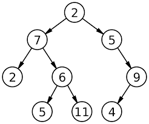
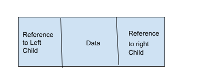
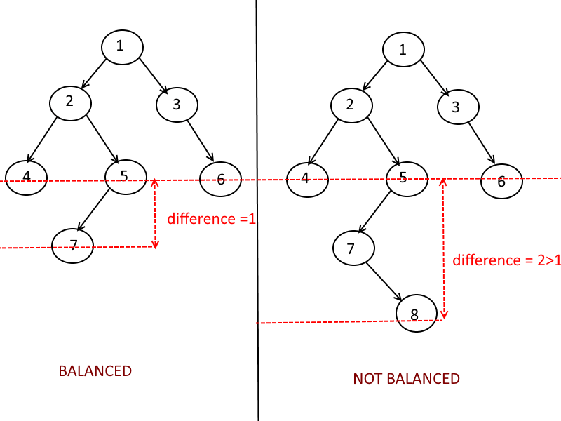

[Back to home page](welcome.md)


# BST


A binary search tree is a way to store data using a set of nodes. In a binary search tree, the information is contained by the actual orientation and organization of the nodes. The way this tree is organized is by having all the nodes follow a rule of if the node's key is greater it will be part of the right sub tree and if the node's key is less then it is part of the left subtree. This creates a structure where all the nodes in the right subtree have greater keys than the nodes on the left side of the subtree. Let's take a look at this tree's name to get a better understanding. The word 'binary' in this trees name is prevelant because each node in this tree has two connections from each node and each binary search tree has two distinguished sub trees. The word 'search' is fitting because this type of tree allows fast lookup O(log(n)). Lastly the word 'tree' is applicable because it has a heirachical tree strcuture like many other of tree data types in programming.

  


### Structure:
As mentioned in the last paragraph, a big part of binary search tress is their organization. 

- **Root Node:** At the very top of the tree is the root node, this is the node that the tree builds out from. 

- **Parent Node:** This is a node that has node connected to it. 

- **Child Node:** The nodes connected to the parent node is called a child node. Each child node to the right of the parent node contains a key greater than the parent. Each child node to the left of the parent node contains a key less than the parent. Two child nodes connected to the same parent node are called siblings.  

- **Leaf Node:** This node is at the bottom of the tree and has no child nodes connected to it. 


 
One of the biggest advantages to a binary search tree are that insertions, deletions and lookups are O(log(n)) if the tree is balanced. This is because you can exclude a subtree with each comparison since the tree's nodes are already organized into subtrees based off of their key.

One disadvantage is that if a binary search tree is unbalanced it can lead to poor performance. With an unbalanced tree insertions, deletions, and lookups can drop down to O(n).

#### Balanced Trees
Having a balanced tree means that the left and right subtrees are a similar size. In a balanced tree, the heights of either subtree have a difference of at most 1. Red black trees and AVL trees are a type of binary search trees. These are known as self-balancing binary search tree because they were designed to avoid the issues of unbalanced trees.



### Operations:
**Insert**
When inserting a new node is always inserted at a leaf or at the bottom of the tree. In order to insert new data, we need to compare each node with our data to see if the data belongs on the left or the right side of the subtree. Starting with the root node and continuing the process until there is an empty spot.
```python
def insert(self, data):
	
	if self.root is None:
		self.root = BST.Node(data)
	else:
		self._insert(data, self.root)  # Start at the root

def _insert(self, data, node):

	if data < node.data:
		# The data belongs on the left side.
		if node.left is None:
			# We found an empty spot
			node.left = BST.Node(data)
		else:
			# Need to keep looking.  Call _insert
			# recursively on the left subtree.
			self._insert(data, node.left)
	elif data >= node.data:
		# The data belongs on the right side.
		if node.right is None:
			# We found an empty spot
			node.right = BST.Node(data)
		else:
			# Need to keep looking.  Call _insert
			# recursively on the right subtree.
			self._insert(data, node.right)
```

**Traverse**
When traversing a BST you will visit each node going from largest to smallest values or smallest to largest values. Reccursion is often used for this operation.

```python
def __iter__(self):
	
	yield from self._traverse_forward(self.root)  # Start at the root

def _traverse_forward(self, node):
	
	if node is not None:
		yield from self._traverse_forward(node.left)
		yield node.data
		yield from self._traverse_forward(node.right)

```

**Delete**
This operation is similar to inserting. When deleting a value from a BST you need to search the list for the value. Once the value is found you can remove the node.

```python
 Deleting a node
def deleteNode(root, key):

    # Return if the tree is empty
    if root is None:
        return root

    # Find the node to be deleted
    if key < root.key:
        root.left = deleteNode(root.left, key)
    elif(key > root.key):
        root.right = deleteNode(root.right, key)
    else:
        # If the node is with only one child or no child
        if root.left is None:
            temp = root.right
            root = None
            return temp
```

**Search**
When searching for a value in BST you start with the root node and compare the values to see which side of the tree the value is on. Continue comparing the value and determining which subtree the value would be part of. 
```python
def search(root, value):
    # node is empty
    if root is None:
        return False
    # if element is equal to the element to be searched
    elif root.data == value:
        return True
    # element to be searched is less than the current node
    elif root.data > value:
        return search(root.leftChild, value)
    # element to be searched is greater than the current node
    else:
        return search(root.rightChild, value)
```
*Time Complexity Chart*

| Operation | Time      |
|----------:|:---------:|	     	
| Insert    | O(log(n)) |	
| Search    | O(log(n)) |	
| Delete    | O(log(n)) |
| Traverse  | O(n)	    |


## You Try

**Search for a similar value in a BST**
_Create a function that will find the closest value to a given target value_

```python

class BST:
    class Node:

        def __init__(self, data):

            self.data = data
            self.left = None
            self.right = None

    def __init__(self):
        self.root = None


    def insert(self, data):
        if self.root is None:
            self.root = BST.Node(data)
        else:
            self._insert(data, self.root)  


    def _insert(self, data, node):
        if data == node.data:
            return
        elif data < node.data:
            if node.left is None:
                node.left = BST.Node(data)
            else:
                self._insert(data, node.left)
        else:
            if node.right is None:
                node.right = BST.Node(data)
            else:
                self._insert(data, node.right)


####################################################
#                  Problem start                   #
####################################################

   
    def closest_value(self, target, closest_node):
        current_node = self.root
        return self.find_closest_value(current_node, target, closest_node)

    def find_closest_value(self, current_node, target, closest_node):
		'''
		*Hint: 
		-You can use recursion
		-It can be done in log(O(n))
		'''
                                  
###################################################
#                  Problem end                    # 
###################################################

# Test your code
bst = BST()
bst.insert(5)
bst.insert(3)
bst.insert(7)
bst.insert(4)
bst.insert(10)
bst.insert(6)

print(bst.closest_value(8, 10000)) #7
```
[Solution](solution.md)