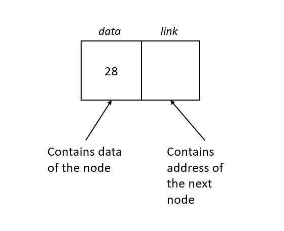
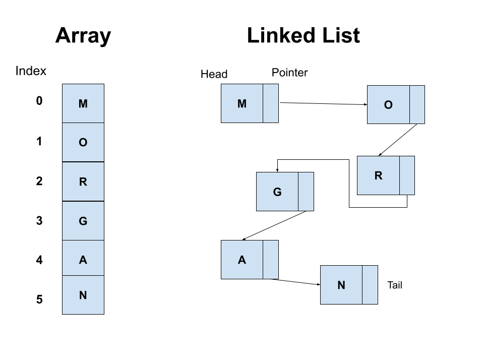

[Back to home page](welcome.md)

# Linked Lists

## Structure:

In programming, a linked lists is a linear collection of data where the placement of the list's elements in memory does not determine the order of the elemnets in the list. Instead, linked lists use pointers which is the 'link' that holds th list together. Linked list's are made up of a collection of Nodes which store the elements in the list and the sequence of the list. Understanding how nodes and pointers work is crucial to understanding this data structure.


**Node:**

Each node contains one value and one pointer. The pointer is a reference to the next member of the list. One way to understand a pointer is to think of it as the memory adress of the next node. If node's pointer is null, then it is the last node in the list and is the tail. In linked lists a local pointer variable is used to point to the first item of the list, also known as the head. If the pointer to the head of the list is also null then the list is empty.



**Doubly linked list:**
A singly linked list and a doubly linked list are two common forms of linked lists. The main difference between a singly linked list and a doubly link list is that in a doubly linked list the node contains pointers to both the next node and the previous node in the list. Today we will be working with doubly linked lists.


#

## Operations:
_Here are some examples of different linked list operations in python_

**Inserting:** 

When inserting node at the beginning of the list, we need to make sure the new node becomes the head by making the new node point to the previous head and the previous head point to the new head. Lastly the head needs to point to the new node.

```python
def insert_head(self, valuw):

    # Create the new node
    new_node = LinkedList.Node(value)  
        
    # If the list is empty, then point both head and tail to the new node.
    if self.head is None:
        self.head = new_node
        self.tail = new_node
            
    # If the list is not empty, then only self.head will be affected.
    else:
        new_node.next = self.head # Connect new node to the previous head
        self.head.prev = new_node # Connect the previous head to the new node
        self.head = new_node      # Update the head to point to the new node
```

**Deleting:**

When deleting a node at the head of the list, we need to disconnect the head of the list and update the list so the head now points to the node next in the list.

```python
def remove_head(self):

    # If the list has only one item in it, then set head and tail to None resulting in an empty list. 
    if self.head == self.tail:
        self.head = None
        self.tail = None
    
    # If the list has more than one item in it, then only self.head will be affected.
    elif self.head is not None:
        self.head.next.prev = None  # Disconnect the second node from the first node
        self.head = self.head.next  # Update the head to point to the second node      
```

**Replacing:**

When replacing a node in the list we need to iterate through the list starting with the head and checking each node to see if it contains the data we want to replace. Once found, we will update the nodes data.

```python
def replace(self, old_data, new_data):
      
    # Start with the head of the list 
    curr = self.head

        # Then iterate through each node 
        while curr is not None:

            # Check the node to see if it contains the 'old_data'
            if curr.data == old_data:
              
                curr.data = new_data # When the node is found, replace it's data with the 'new_data'
            
            curr = curr.next # Update the variable to be the next node
```

#
## Applications:
_Some ways linked lists are usefu:_

* Dynamic Memory allocation 
* Implement stacks, hash tables, binary trees
* Undo in software

#
## Linked list vs Array

**Advantages:**
List elements can easily be removed or inserted because linked lists are stored in memory with no strict order. This helps us avoid needing to reallocate or reorganize the entire list.


**Diadvantages:**
They do not allow random access to the data which makes things like obtaining the last node of the list, finding a specific node, or inserting a node in a specific place in the list inefficient O(N). In an array you can acess the elements by using addresses or indicies O(1).



#
_Python time complexity chart_


|  Operation   | Linked List  |  
|:------------:|:------------:|	
|Insert head   | O(1)		  | 
|Insert middle | O(n) 	      |  
|Insert tail   | O(1)         |  
|Remove head   | O(1)         |  
|Remove middle | O(n)         |  
|Remove end	   | O(1)         |  
|Acess element | O(N)         |

#
## You Try:

**Retrieving data at a certain index**

*Create a function that will take in a value for index and then will retrieve the data from the node in the given index*

```python
class LinkedList:

    class Node:
       
        def __init__(self, data):
           
            self.data = data
            self.next = None
            self.prev = None

    def __init__(self):
        
        self.head = None
        self.tail = None


    def insert_head(self, value):
       
        new_node = LinkedList.Node(value)  
        
      
        if self.head is None:
            self.head = new_node
            self.tail = new_node

    
        else:
            new_node.next = self.head 
            self.head.prev = new_node 
            self.head = new_node      


####################################################
#                  Problem start                   #
####################################################

    def get_value(self, index):
        '''
        Example: list = [50, 60, 70, 80]  index value given = 2
        Returned answer should be 70

        *Hint: Use iteration, it can be done with O(1) time
        '''

        curr = self.head
                                  
###################################################
#                  Problem end                    # 
###################################################
      
    def __iter__(self):
        """
        Iterate foward through the Linked List
        """
        
        curr = self.head  
        while curr is not None:
            yield curr.data 
            curr = curr.next 
    

    def __str__(self):
        """
        Return a string representation of the linked list.
        """
        output = "linkedlist["
        first = True
        for value in self:
            if first:
                first = False
            else:
                output += ", "
            output += str(value)
        output += "]"
        return output
    

# Test your code:
linked_list = LinkedList()
linked_list.insert_head(52)
linked_list.insert_head(41)
linked_list.insert_head(32)
linked_list.insert_head(21)
linked_list.insert_head(12)
linked_list.insert_head(10)

print(ll.get_value(3)) # 32

```

[Solution](solution.md)