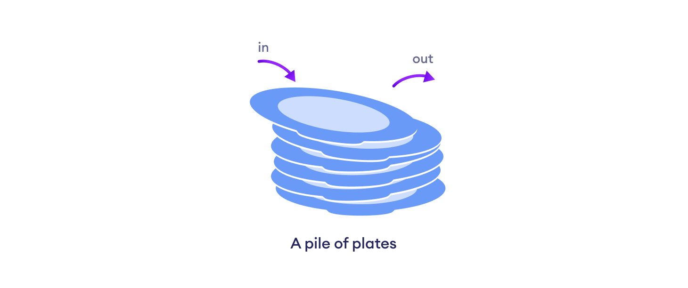
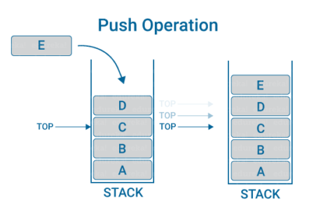
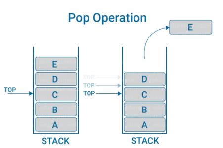
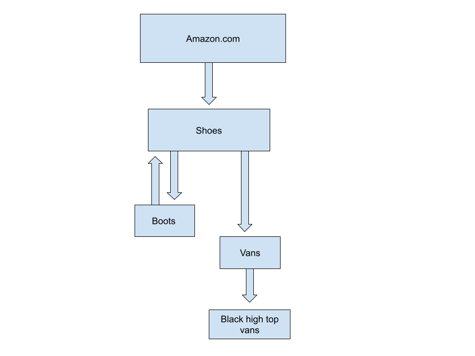

[Back to home page](welcome.md)

# Stacks


Imagine you are browsing the ineternet. You are going page to page, exploring each new link you click on. As you continue to navigate to new pages, your computer keeps track of the pages you have visited by adding it to the history. When you decide to hit the back button the computer will take you back to the most recent page you visited. This is a great example of a stack and how it allocates data. In simple terms, a stack is a linear data structure that is used often in programming.


One way to think about a stack is like a stack plates. In order to create a larger stack you can add more plates by placing one on top of another. In order to remove a plate you must take the plate off of the top of the pile of plates. Removing a plate from the middle or the bottom of the stack of plates will result in the pile of plates falling over and breaking. This demonstrates the way a stack stores items, which is kown as LIFO.



## Lifo
The way a stack works is by storing items in a manner where the most recent item added is also the item that is next to be removed. This is reffered to as LIFO or Last In First Out. Items are only added and removed at one end so the item at the top of the stack is the first item that will be removed. As items are coninued to be added to the stack, you will have to remove each item from the top one by one to reach the bottom. An easy way to think of this is like an undo button.

#
## Operations: 

#### Push & Pop
_Push and Pop are the operations of adding and removing items in a stack. These two operations both have a time complexity of O(1)_

**Push**

This is the operation that adds elements to a stack. By using this operations it will push items onto the top of the stack and make the stack grow larger and larger.

```python
stack = [1,2,3]
stack.append(4)
print(stack) # [1, 2, 3, 4]
```



**Pop**

This is the operation that removes elements from a stack. By starting with the most recently added element or the top of the stack and working its way down until the first item added is removed.

```python
stack = [1,2,3]
print(stack.pop()) # 3
print(stack) # [1, 2]
```




#
#### Real life example:
Earlier, stacks were introduced through the example of browing the internet. Now were going to take a closer look at how exactly a stack would look in this scenario. Below, there is a diagram to help demonstrate.  With each arrow on the diagram it represents a click to a new page and each box represents an element added to the stack (or in this case the browsing history). First, you start off by opening up amazon.com. You are looking for a new pair of shoes so in the navigation bar you type in 'shoes' and press search. The results for shoes page pops up and is now added as the second item in the stack because it is the second page you have visited. On the shoes page you see a pair of boots that you are interested in, so you click on the boots and it brings you to a new page. After looking at the boots you decide that you don't love them so you hit the back arrow. By hitting the back arrow you undo your search, remove the boots page from your stack and are now on the 'shoes' results page again. After some more scrolling you find a pair of red vans you like so you click on them. When you visit this page you scroll down and see 'Products related to this item'. This is where a pair of black, high top vans catches your eye so you click on the image. 

**By the end of your searching on amazon your stack would be composed of:**
1. Amazon's home page
2. Shoes result page
3. Red van's page
4. Black high top vans page



#
#### Stacks can be useful in many ways:
* Reversing a word
* Redoing and Undoing
* Backtracking

#
## Python

**Using lists:** 
Python's built in list can be used as a stack data structure because you can use the push and pop operations with O(1) time.  The only issue with using the python built in lists is that they are implemented as dynamic which means that occasionally a list will need to be resized by allocating more space for memory then transfering all of the elements to the new list. Having this happen will take extra time and can be inefficient. On the other hand, lists provide fast random access to elements on the stack O(1), time. 


#
_Python time complexity chart_

| Operation | Time | Python Syntax     | Time |
|:---------:|:----:|:-----------------:|:----:|
| push()    | O(1) | list.append(item) | O(1) |
| pop()     | O(1) | list.pop(index)   | O(1) |           


### You Try:

**Reversing using a stack**
_Create a function that will take a list and return the reversed version of the list using a stack_

 
```python
def reverse(stack):
    '''
    Example:
    This list is passed in- [1, 2, 3, 4,]
    This should be the returned list- [4, 3, 2, 1]
    
    *Hint: Use append and pop 
    '''
    # Initialize an empty list
    reverse_list = []


list = [10, 11, 12, 13]
print(reverse(list)) # [13, 12, 11, 10]

list = ['f', 'l', 'o', 'w']
print(reverse(list)) # ['w', 'o', 'l', 'f']

```
[Solution](solution.md)


**Challenge: Try to reverse strings**
*Example: 'desserts' should be returned as 'stressed'*


